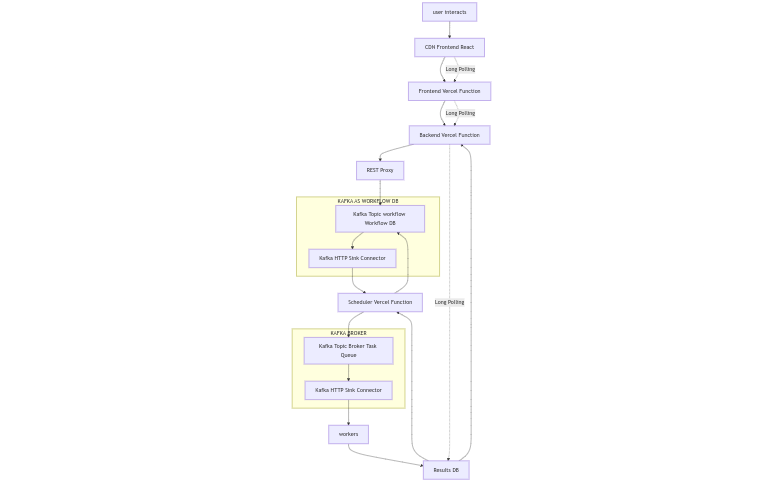

# api-service
This repository contains the user-facing backend service for the minireipaz project. It serves as the core API that the frontend communicates with, providing essential functionalities and data management. Built with Go, it ensures high performance, scalability, and reliability to support various user interactions and workflows.

## Project Description

This project implements a workflow automation platform using architecture that combines Vercel Functions with Kafka Confluent and an HTTP connector. This solution is designed to overcome the limitations of Vercel's serverless functions, allowing for the execution of complex and long-running workflows.

## Architecture

### Main Components

1. **Frontend and Initial API**: Hosted on Vercel
2. **Vercel Functions**: For quick operations and initial request handling
3. **Kafka Confluent**: As a central event bus
4. **Confluent HTTP Connector**: To receive events from Vercel Functions
5. **Processing Services**: Kafka consumers to execute workflows
6. **ClickHouse**: As a database to store results and workflow data

### Workflow

1. Users interact with the frontend hosted on Vercel.
2. Quick requests are handled directly by Vercel Functions.
3. For tasks that require more than 10 seconds:
   - The Vercel Function sends an event to the Kafka HTTP connector.
   - The event is stored in a Kafka topic.
   - A consumer service processes the event and executes the workflow.
4. Results and states are stored in ClickHouse.

## Architecture Justification

### Vercel Functions Limitations

- **Maximum execution time**: 10 seconds
- **Lack of native triggers**: No support for scheduled or complex event-based executions

### Choosing Confluent Cloud Kafka over Upstash Kafka

- Triggers to Vercel Functions:

  <b>Upstash Kafka:</b> Does not support direct triggers to Vercel Functions.
  <b>Confluent Kafka:</b> Offers an HTTP connector that can send data directly to Vercel Functions, enabling real-time processing and more efficient workflows.

- Polling Interval:

  <b>Upstash Kafka:</b> Uses a service called QStash, which has a minimum polling interval of 1 minute. This delay is not suitable for use cases that require more immediate data processing.
  
  <b>Confluent Kafka:</b> The HTTP connector allows for near-instantaneous data transmission to Vercel Functions, ensuring timely processing without the limitations of a minimum polling interval.
  
### Reasons for Choosing Double-Writing Over CDC with Debezium or similar for Kafka Integration

When integrating event-driven systems like Apache Kafka with databases, the "double-writing" approach—writing data both to the database and Kafka—can lead to potential consistency issues. However, in certain scenarios, such as relying on free SaaS (Software as a Service) solutions, double-writing might be the practical choice. Here are the reasons why double-writing is preferred in our situation:

- Free SaaS Solutions: We depend on free SaaS offerings which provide necessary services at no cost. These services often do not support advanced features like change data capture (CDC) directly from their databases, limiting our ability to use solutions like Debezium.

- Infrastructure Limitations: Running a CDC tool like Debezium requires dedicated infrastructure and resources to manage and maintain the setup. Given our current limitations in infrastructure and resource availability, double-writing becomes a more feasible option.

- Quicker Implementation: Double-writing can be implemented more quickly compared to setting up a full CDC pipeline with Debezium. This allows us to achieve our integration goals faster, meeting immediate project deadlines and requirements.

- Simplicity: Double-writing involves straightforward code changes to ensure data is written to both the database and Kafka, simplifying the implementation process without needing in-depth CDC expertise.
Flexibility:

- Adaptable to SaaS Limitations: Many free SaaS platforms have limitations on direct access to their databases or transaction logs. Double-writing allows us to bypass these limitations by writing data to Kafka directly from our application layer.

- Custom Workflows: Double-writing enables us to create custom workflows tailored to our specific needs, which might not be fully supported by a standard CDC tool.

- Short-Term Viability: Double-writing serves as a viable interim solution while we assess and plan for a more robust CDC implementation in the future. It allows us to meet current project requirements and maintain progress.

- Evaluation Phase: This approach provides us with the opportunity to evaluate the actual requirements and benefits of a full CDC setup, ensuring that any future investment in Debezium or similar tools is well-justified.


### Solution: Kafka Confluent with HTTP Connector

This architecture allows us to:
1. Simulate triggers by sending events to Kafka through an HTTP endpoint.
2. Handle long-running processing outside of Vercel Functions.

### Pros and Cons

#### Pros:

1. **Decoupling**: Separates initial business logic from long-running processing.
2. **Scalability**: Kafka can handle large volumes of events.
3. **Persistence**: Events are stored in Kafka, providing reliability.
4. **Flexibility**: Easy to add new event producers or consumers.
5. **Asynchronous processing**: Allows handling of long-running tasks.
6. **Compatibility**: Integrates well with existing Vercel-based infrastructure.

#### Cons:

1. **Additional complexity**: Introduces new components that need to be managed.
2. **Cost**: Kafka Confluent has associated costs.
3. **Latency**: There may be a small increase in latency.
4. **Learning curve**: Requires knowledge of Kafka and its ecosystem.
5. **Maintenance**: Needs additional configuration and maintenance.




## Use of Cached Tokens
To reduce the load on authentication and authorization systems, a cache store (in this case, Redis) is used to temporarily store access tokens for service users. This approach avoids the need to generate a new access token with each serverless function call, significantly enhancing performance. 

The `serviceuser_backend:token` key is used to store the backend service user's access token, with a Time-to-Live (TTL) of -1.
The `serviceuser_action:token` key is used to store the action service user's access token, with a Time-to-Live (TTL) of -1.

The authentication and authorization for this system are managed using ZITADEL, which supports a maximum of 100 Daily Active Users (DAU), defined as users who authenticate or refresh their tokens within a given day. Given this limitation, we leverage caching and avoid token rotation in development environments, for example, to ensure we stay within usage limits while optimizing system efficiency.

The relevant code for this process is as follows:

```go
cachedToken := authService.GetCachedServiceUserAccessToken()
```

If the cached token is unavailable or expired, a new token is generated and stored in the cache:
```go
// in dev state, not rotating service user access token in serverless functions
if ac.config.GetEnv("ROTATE_SERVICE_USER_TOKEN", "n") == "y" {
    if cachedToken == nil {
        // Rotate token if it's expired or not found
        _, err := authService.GenerateAccessToken()
        if err != nil { // error saving retry read
            cachedToken = authService.GetCachedServiceUserAccessToken()
        }
    }
}
```

serviceuser_backend:token and TTL -1

## WorkflowHTTPRepository
This struct manages HTTP operations related to workflows. Its primary methods include:

- `NewWorkflowClientHTTP`: Factory method for creating a new repository instance.
- `GetWorkflowDataByID`: Retrieves data for a specific workflow.
- `GetAllWorkflows`: Fetches data for all workflows associated with a user.
- `Database Interaction`:  The database exposes a pipe endpoint with JSON API. Parameters user_id, limit_count, user_token are passed as URL query parameters.
- `URL construction`: user token management are handled through the config.ClickhouseConfig struct.

Example curl:

```bash
curl -v 'https://api.tinybird.co/v0/pipes/workflow_data.json?limit_count=1&token=p.eyJ1Ijo.......7c&user_id=286098669831248953&workflow_id=03ea380f-da37-4310-ad1c-550a9380ade4'
```

Example pipe endpoint:

```
NODE endpoint
DESCRIPTION >
    This node selects workflows for a specific user and by workflow id
PARAMETERS >
    user_id String
    limit_count String
SQL >
%
SELECT 
    w.id,
    w.user_id,
    w.name,
    -- ... (other fields)
FROM workflows w FINAL
LEFT JOIN executions e ON w.id = e.workflow_id
WHERE w.user_id = {{String(user_id, "")}}
LIMIT {{UInt32(limit_count, 1)}}
```

### Usage:
To utilize this client, instantiate WorkflowHTTPRepository with the appropriate configuration and invoke its methods to interact with workflows.

```go
client := // ... initialize HTTP client
config := // ... initialize Clickhouse configuration
repo := NewWorkflowClientHTTP(client, config)

// Fetch data for a specific workflow
workflowData, err := repo.GetWorkflowDataByID(&userID, &workflowID, limitCount)

// Fetch all workflows for a user
allWorkflows, err := repo.GetAllWorkflows(&userID, limitCount)
```

### Errors
TODO

### Retries

#### Retries with General Error Classification

- **HTTP 4xx errors:** Generally not candidates for automatic retries, with specific exceptions.
- **HTTP 5xx errors:** Potential candidates for retries, but with caution.
- **Network or timeout errors:** Usually appropriate for retry attempts.

#### Retries with Error-Specific Retry Strategies

- **HTTP 429 (Too Many Requests):** Implement retries with exponential backoff, respecting "Retry-After" headers if present.
- **HTTP 500, 502, 503, 504:** Retry with exponential backoff.
- **Connection or timeout errors:** Immediate retry for the first couple of attempts, then apply backoff.
- **HTTP 400, 401, 403, 404, etc.:** No automatic retries; log for review.

#### Exponential Backoff Implementation

1. Initialize with a base delay (e.g., 1 second).
2. Apply exponential factor on each attempt: 1s, 2s, 4s, 8s, etc.
3. Incorporate random jitter to prevent retry synchronization.
4. Set a maximum delay threshold (e.g., 60 seconds).

#### Retry Attempts

- Define a maximum retry count (e.g., 3-5) based on the operation type.
- Consider the total acceptable time window for the operation.

#### Persistent Failure Handling

- After exhausting retry attempts, log detailed error information.
- Implement a circuit breaker pattern to prevent system overload.

#### Monitoring and Logging

- Log each retry attempt with relevant data (error type, attempt number, delay).
- Set up alerts for recurring error patterns.


## Makefile

This project utilizes a Makefile to automate common development and testing tasks.
Available commands are:

```
make openapi_http
make lint
make test
make fmt
```

`make openapi_http`: Generates HTTP API client code from the OpenAPI specification.
`make lint`: Analyzes the source code to identify and report stylistic errors and programming mistakes.
`make test`: Runs the test suite to ensure that the code is functioning correctly.
`make fmt`: Formats the source code according to the project's style.


### openapi_http

To generate the OpenAPI documentation, simply run the following command:

```
make openapi_http
```

makefile details:

```
.PHONY: openapi_http
openapi_http:
	@echo "Generating OpenAPI documentation for the HTTP API..."
	@./scripts/generate_openapi.sh
```

### lint

Lints the Go codebase using golangci-lint.

Installation (optional):

If you need to install `golangci-lint` and `go-cleanarch`, run the script with the -install option:
```
./scripts/lint.sh -install
```

This will:
- Download and install `golangci-lint` version v1.59.1.
- Display the installed version of `golangci-lint`.
- Install the `go-cleanarch` tool.

Script details:

This will execute `golangci-lint` with the specified options:
-v: Enable verbose output.
--tests=false: Exclude tests from linting.
--timeout=2m: Set the timeout to 2 minutes.
--config ./.golangci.yaml: Use the specified configuration file for `golangci-lint`.


### fmt
This command will format all Go files in the current directory and its subdirectories using `goimports`.
```
make fmt
```

makefile details:

```
goimports -l -w -d -v ./
```

-l: Lists the files that would be formatted.
-w: Writes the formatted content directly to the files.
-d: Displays the diffs instead of applying them.
-v: Verbose mode, providing detailed output.


### test

By running the make test command, both the unit and E2E test suites will be executed sequentially. 

To run the tests, execute the following command. The tests will automatically retrieve the necessary environment variables:
```
make test
```

makefile details:

```
test:
	@./scripts/test.sh .env
	@./scripts/test.sh .e2e.env
```

Environment Variables:

.env: This file contains the environment variables for the main test suite.
.e2e.env: This file contains the environment variables for the end-to-end (E2E) test suite.

`./scripts/test.sh`: This script is responsible for executing the tests. It reads the environment variables from the specified files and runs the tests accordingly.
